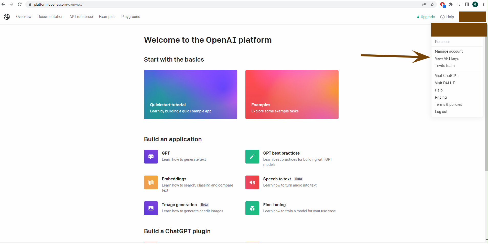
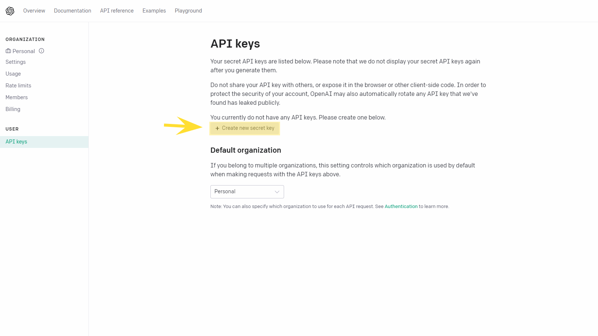
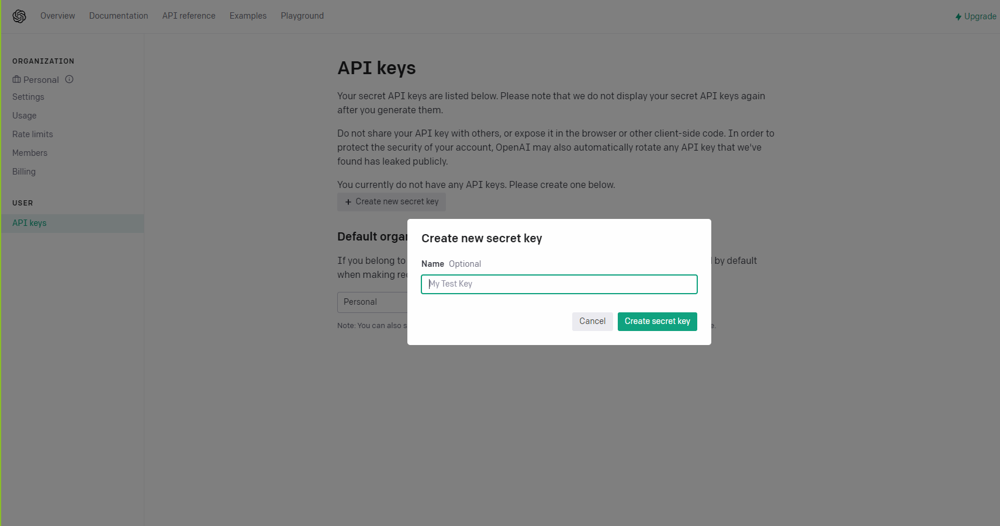

The application will need to get the following kinds of data from third-
party sources:

Response data from ChatGPT API
https://platform.openai.com/

## Step 1: Go to URL, create an account and navigate to personal page

## Step 2: Press to create a secret key

## Step 3: Generate key

